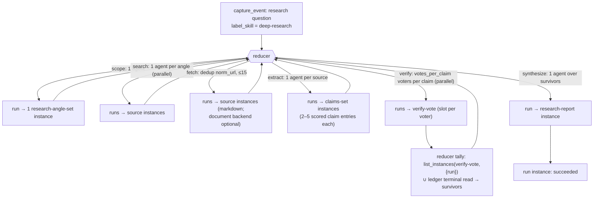

# Dynamic workflows in escurel — a concept

**Date:** 2026-07-11.
**Status:** Concept / design proposal, accepted for phased delivery (see the
implementation plan). **Scope:** How to bring Claude Code's
`/deep-research`-style **dynamic workflows** (deterministic,
script-orchestrated fan-out of many subagents with phases, parallelism,
adversarial verification, and synthesis) into escurel — mapped onto escurel's
own idioms: **agent calling via webhooks, new data via events, steering via
skills, and skill instances as markdown *and* SQL.**

This is a concept, not a spec. It deliberately extends the existing
[`agent-orchestration.md`](agent-orchestration.md) contract and reuses the
`escurel-runner-*` crates almost wholesale — the new surface is one
deterministic reducer plus two skill kinds.

---

## TL;DR

- A workflow is **not a second execution model** beside escurel's runner —
  it is the runner's existing **reactive event → agent → event loop with
  its emit policy generalized.** The runner is already a reducer, just a
  degenerate one: `emit_cascade` emits **at most one** follow-on event per
  confirmed cross-skill write, with no join. A workflow keeps the loop and
  generalizes that policy along three axes — an **explicit multi-phase
  plan**, **fan-out width > 1**, and a **quorum barrier**. Every
  deep-research primitive already has an escurel counterpart: `agent()` =
  one harness run over a webhook `Trigger`; isolated context windows =
  per-run subprocess + per-run dir + the narrowed MCP tool surface;
  `capture_event` lineage = the cascade bridge. (Three things the concept
  needs are genuinely *new*, not reuse — deterministic step identity, a
  workflow-aware recovery pass, and per-run/per-phase least privilege — and
  the doc flags each rather than pretending they exist.)
- The escurel-native way to add it is **not** to embed a JavaScript
  runtime. It is to keep escurel's inversion: **state lives in the KB as
  events + instances, not in a script's variables.** A workflow becomes a
  **skill** (the plan, in markdown + frontmatter); a run becomes an
  **instance** (the durable, resumable, event-projected state); each
  subagent call becomes an **event** that fires the existing signed
  webhook; and the control flow becomes a **pure reducer over the run's
  event log** — replayable, therefore resumable across process death, and
  automation-free at the gateway.
- The "skill instances as markdown *and* SQL" idiom shows up twice:
  fetched sources can become **`document`-backend instances** (chunked,
  embedded) for large binaries — an *optional* path that needs the ingest
  event relineaged into the run — and the verify barrier is a **run-scoped
  frontmatter query** over `verify-vote` instances. The barrier *decision*
  runs on the agent-safe `list_instances` surface (not admin-only
  `run_stored_query`); the SQL view is the operator-facing inspection form
  of the same tally.

---

## 1. One shape: reactive projection, generalized

It is tempting to draw a `/deep-research` workflow as a *second* shape
beside escurel's runner — "deterministic fan-out orchestration" vs. the
runner's "reactive projection loop." That framing is wrong, and dropping
it is what makes the integration clean.

**A workflow invocation is itself an inbox event.** Running
`/deep-research` is `capture_event(label_skill=deep-research)` landing in
the inbox; the runner picks it up **reactively**, exactly like any
external event. So "proactive vs. reactive" is a false axis — both are
inbox-event-triggered, and the only difference is *who* captured the
initiating event (an external source vs. a human via `escurel workflow
run`). There is one execution model: the reactive
event → agent → event projection loop escurel already runs
([`agent-orchestration.md`](agent-orchestration.md)).

**The runner is already a reducer — a degenerate one.** On a confirmed
**cross-skill** write, `emit_cascade` emits **at most one** follow-on event
(to the produced skill's `cascade_target`, else unassigned); a same-skill
hop emits **zero** and the chain quiesces. That *is* a plan-driven emit
policy — just a hardwired one, with **width ≤ 1 and no join.** A workflow
doesn't replace this loop; it **generalizes its emit policy** along exactly
three axes the cascade leaves fixed:

| axis | reactive cascade *today* | workflow = the *general* case |
|---|---|---|
| initiating event | an inbox event (external `capture_event`) | an inbox event (`workflow run` `capture_event`) — *same* |
| the plan | **implicit** — whichever skill the hop's agent reads, one hop at a time | **explicit** — a multi-phase `kind: workflow` skill the reducer reads |
| emit width per hop | **≤ 1** — a fixed cross-skill rule (`emit_cascade`) | **N** — the reducer emits a *set* of step-events (`parallel()`) |
| join / barrier | **none** — hops are independent, depth-bounded only | **quorum** — a phase waits for K sibling completions (the SQL vote tally) |
| verification | reconciler read-back (did the write land?) | + adversarial — 3 skeptic votes/claim, ≥2 refute kills it |
| state | the KB (events + instances) + run ledger | **same** — the KB + ledger (no script variables) |
| termination | reducer emits nothing (no cross-skill change) / depth / cycle | reducer emits nothing (all phases done) / depth / cycle |
| output | an updated instance | + a synthesised `research-report` instance |

Everything below the first two rows is *one loop at two settings of the
same knobs.* The runner already owns **trigger lifecycle, a bounded
dispatch queue, a durable ledger with idempotency/dedup, loop controls
(depth/budget/cycle), the context packager, the `Harness` adapter trait,
the reconciler, the per-tenant quota governor, and the cascade lineage
carrier.** A workflow needs exactly one change: **generalize the fixed
`emit_cascade` policy into a plan-driven reducer** that can emit a *set*
of events and recognise a *barrier*. The reactive loop, the webhook, the
ledger, `admit`, and the quota governor are untouched — this is why it
integrates rather than bolts on.

---

## 2. The escurel reframing: script → triad

Claude Code's Workflow tool executes a **JavaScript script** whose
`agent()`/`parallel()`/`pipeline()` calls fan out subagents while
intermediate state sits in **script variables outside any context
window**. Resumability is a cache keyed on the call sequence; determinism
is enforced by banning `Date.now()`/`Math.random()`.

escurel's whole thesis is the inverse of "state in variables": *an
instance's state is the projection of its event sequence, mediated by
skills.* So the faithful port is not "run JS inside escurel" — it is to
express the same computation in the triad:

| deep-research (JS) | escurel idiom | mechanism (existing unless noted) |
|---|---|---|
| the workflow script (`export const meta`, JS body) | a **workflow skill** — markdown plan + declarative frontmatter | a `type: skill, kind: workflow` page; steered by editing it |
| `args` (the invocation input) | a **`capture_event`** that starts a run | `capture_event` / inbox |
| `agent(prompt, {schema})` | one **harness run** packaged from a step **event** | `Trigger` → `package` → `Harness::run` → `reconcile` |
| calling a subagent | firing the **signed webhook** per step event | `POST /trigger` + HMAC (ADR-0003) |
| structured output (`StructuredOutput` tool) | a **typed instance** + `validate` | `required_frontmatter` + `validate`/`update_page` |
| `parallel()` barrier | a set of §3.6-keyed step events + a **run-scoped tally** | reducer + `list_instances` ∪ ledger read (agent-safe) — **new** |
| `pipeline()` (per-item, no barrier) | the **reducer** emitting per-item step events | new reducer (`provenance.workflow.over`) — *not* `emit_cascade` |
| `phase(title)` | a `phase` field + `phase.entered` marker event | events + run-instance overlay |
| `budget` / concurrency caps | the **quota governor** + **loop limits** (reserved up front) | `quota::Governor`, `admit::LoopLimits` |
| isolated context window per subagent | per-run **subprocess + per-run dir + narrowed MCP surface** | `ALLOWED_TOOLS`, per-run dir (per-run JWT = **new**) |
| resume cache (in-session only) | **re-invoke `reduce` per non-terminal run** (survives restart) | new workflow-aware recovery pass — **not** `recover_pending` |
| the final report in your conversation | a **`research-report` instance** (durable KB memory) | `update_page` |
| deterministic script (no wall-clock/rand) | a **pure reducer** over the event log | new `escurel-runner-workflow` crate |

The central new idea is the **reducer** (with content-addressed step
identity as its keystone); the runner, events, skills, instances, and
frontmatter queries are escurel's existing machinery wearing a plan. §6
lists exactly what is new vs. reused.

---

## 3. Core model

### 3.1 The workflow *skill* (the plan; markdown + frontmatter)

A workflow is a Tier-1 skill page — it appears in `list_skills`, it is
`resolve`/`expand`-able, and **you steer it by editing markdown**, exactly
like escurel behaviour is already data-driven and in-corpus (the way a
skill declares a `cascade_target` today). Per-phase `harness:` selection is
a *new* frontmatter knob (§6), not an existing one.

```yaml
---
type: skill
kind: workflow                 # NEW backend kind; markdown-file-backed
id: deep-research
description: Fan-out web search, adversarially verify claims, synthesize a
  cited report. Invoke on an underspecified research question.
harness: claude                # per-phase override allowed (NEW knob, §6)
run_skill: workflow-run        # the instance kind each invocation produces
phases:
  - id: scope
    produces: research-angle   # one run writes ONE research-angle-set
    fan_out: 1
  - id: search
    produces: source
    fan_out: { over: research-angle }     # one agent per angle instance
  - id: fetch
    produces: source                        # markdown source instance (default)
    dedup_by: norm_url                      #  (document backend = optional, §5)
    max: 15
  - id: extract                             # the claim producer (governed phase)
    produces: claims                        # one claims-set instance per source,
    fan_out: { over: source }               #  holding 2–5 scored claim entries
  - id: verify
    produces: verify-vote
    fan_out: { over: claim, width: verify.votes_per_claim }   # slot per voter
    max_targets: 25                          # rank by importance × source_quality
  - id: synthesize
    produces: research-report
    fan_out: 1
verify:
  votes_per_claim: 3           # single source of truth: fan-out width AND
  refutations_required: 2      #  the barrier threshold both bind from here
---

# deep-research

A harness that answers a bounded question with a cited, fact-checked
report. Each phase's agent reads *this* section for its task framing and
the phase's `produces:` skill for the shape of what it must write.

## scope
Decompose the question into 3–6 distinct search angles. Write one
`research-angle` instance per angle …

## verify
You are a SKEPTIC. Try to REFUTE the claim `{{claim}}`. Write a
`verify-vote` instance with `verdict: refuted | valid` and a one-line
reason citing the source …
```

The frontmatter is the machine-readable orchestration spec (the analogue
of `export const meta` + the phase structure); the markdown body is the
per-phase **instructions** the packager already knows how to deliver
("skills as instructions"). Constants that deep-research hard-codes in JS
(`VOTES_PER_CLAIM=3`, `MAX_FETCH=15`, `MAX_VERIFY_CLAIMS=25`) live here as
frontmatter — **auditable, editable, and versioned in the KB** rather than
baked into a binary.

**One run → one instance** (an escurel invariant: `HarnessOutcome` reports
a single `produced_instance`). So a phase that logically yields *many*
outputs packs them into one instance: the `extract` run writes **one
`claims` set** per source — `claims: [{ id, text, quote, importance,
source_quality }]` in frontmatter — rather than N separate `claim` pages.
The reducer flattens the claim entries across the run's `claims` instances,
ranks by `importance × source_quality`, slices to `max_targets`, and fans
`verify` out over the resulting claim *refs* (`<claims_page>#<claim_id>`),
one `verify-vote` per (claim-ref, `vote_index`). The `importance` /
`source_quality` scalars are written by the extract **harness** (the LLM),
so the reducer's ranking stays a pure `order_by`.

### 3.2 The workflow *run* (the state; an instance = an event projection)

Each invocation materialises one instance of the `workflow-run` skill,
e.g. `markdown/instances/workflow-run/2026-07-11-node-permissions.md`. Its
markdown overlay is the human-readable progress board (phases, counts,
elapsed — the escurel analogue of `/workflows`), but its **authoritative
state is the projection of its step-event log.** That is the whole point:

- **Resume is re-projection.** On runner restart, the workflow-aware
  recovery pass recovers a run by **re-invoking `reduce`** over its KB
  instances + step log and continuing (the *new* recovery pass of §7 —
  escurel's existing `recover_pending` only reconciles individual pending
  rows and never calls `reduce`). Because the state lives in the **tenant
  KB**, resume survives process death (deep-research's JS resume cache does
  not survive leaving the session) — *given* the §3.6 keys that make
  re-emission idempotent.
- **No lead context to pollute.** There is no orchestrator context window
  holding raw search exhaust. Each subagent's exhaust stays in its own
  subprocess and lands as `source`/`claims` instances; the shared state is
  the KB. This is escurel's structural answer to the 200K-context problem
  the multi-agent design set out to solve.

### 3.3 Step events (the fan-out; agent calls over webhooks)

The workflow vocabulary rides entirely on the existing `events` surface —
no new wire type. Every step is a `capture_event` whose `label_skill` is
the phase's `produces:` skill and whose `provenance` carries a `workflow`
block alongside the existing `provenance.runner` lineage:

```json
{ "workflow": { "run": "<run_page_id>", "wf_skill": "deep-research",
                "phase": "verify", "step": "s41", "barrier": "verify",
                "over": "[[claim::c12]]" },
  "runner":   { "root_event_id": "...", "depth": 3, "lineage_path": [...],
                "instance_path": [...], "trace_id": "..." } }
```

The event's **id is the §3.6 `step_key`** (not a fresh ULID) and its
`instance_page_id` is **pre-flagged** to the deterministic target
`markdown/instances/<produces>/<run>-<slot>.md` — the two properties that
make emission idempotent and recovery-confirmable.

The gateway fires its **signed webhook** (`POST /trigger`,
`X-Escurel-Webhook-Signature`) once per step event; the runner's existing
listener normalises each into a `Trigger` and dispatches a harness run.
**Fan-out of width N = emitting N step events**; the runner's dispatch
queue + quota governor already schedule them concurrently and fairly.
This is "agent calling via webhooks" and "new data via events" verbatim —
the workflow adds no ingress path of its own.

### 3.4 The reducer (the core new component; deterministic)

`escurel-runner-workflow` — a new crate beside `escurel-runner-core`,
depending only on `escurel-client` + `escurel-types` (the epic's
independence rule). It is the **generalization of `emit_cascade`**: where
`emit_cascade` is a fixed policy returning ≤1 event, the reducer is a
plan-driven policy returning a *set* of events (possibly zero). A **pure
planner**:

```
reduce(spec: WorkflowSkill, log: &[StepEvent]) -> Vec<StepIntent>
```

Given the immutable workflow skill and the run's step events, it returns
the next batch of step events to emit — or empty (run is done). It **calls
no LLM and performs no write reasoning**; all intelligence lives inside
harness runs. Its only job is control flow: sequence phases, open
`parallel()` barriers, chain `pipeline()` stages, tally votes, and decide
termination.

**How it enumerates a fan-out set.** A step confirms *one* produced
instance (`HarnessOutcome.produced_instance` is a single `Option<String>`,
and `update_page` emits no event), so the reducer cannot learn "the 4
angles the scope run wrote" from the event log. Instead it **reads the
instances**: `list_instances(<produces>, {workflow_run: run})` — the
agent-surface, run-scoped frontmatter query — returns the phase's outputs,
and the reducer fans out one step per element (§3.6 keys each). Fan-out
*width* is therefore data the reducer reads, not a number an agent reports.
This also keeps **ranking deterministic**: "slice to the top 25 claims by
importance × source-quality" is an `order_by`/`limit` over the
`importance` and `source_quality` scalars the extract harness wrote into
each claim's frontmatter — not a judgement the pure reducer makes.

Determinism is the same contract deep-research enforces: **no wall-clock,
no `Math.random()`** inside `reduce`, and every emitted step carries a
content-addressed id (§3.6). Given the same instances + log it returns the
same intents, which is what makes replay-based resume correct.

This slots into the **existing** dispatch call site: after the reconciler
confirms a write, the loop today calls `emit_cascade`; for a
workflow-labelled run it calls `reduce` instead (the cascade emitter is
the width-1 branch of the same decision) and `capture_event`s each
returned `StepIntent`. The existing `admit` gate (`max_depth`,
`max_runs_per_root`, cycle) still guards every emitted event, so a runaway
workflow dead-letters exactly like a runaway cascade.

### 3.5 The barrier tally (skill instances as a frontmatter query)

deep-research's verify phase is a **barrier with a vote count**: gather
`votes_per_claim` votes per claim, kill any claim with ≥ `refutations_required`
refutations. Each vote is a `verify-vote` instance; the barrier decision
is a **read over those instances filtered by run**.

**The decision path is agent-safe, not admin SQL.** `run_stored_query` is
**admin-gated** in escurel (arbitrary SQL over the whole corpus) — routing
the barrier through it would force the runner to hold an admin token,
widening its blast radius to `tenant_delete` / `register_credential`. So
the load-bearing tally uses the **`Role::Agent` surface** the runner
already has: `list_instances(skill_id='verify-vote', filter={workflow_run:
<run>})` returns the run's votes, and the reducer counts them **in Rust**:

```
votes  = list_instances("verify-vote", { workflow_run: run })
by_claim[v.claim].slots.insert(v.vote_index)          // dedup by slot
by_claim[v.claim].refutations += (v.verdict == "refuted")
```

Three properties make this correct where a raw `HAVING count(*)` is not:

- **Monotonic under retries/at-least-once.** Votes are tallied by
  `COUNT(DISTINCT vote_index)`, not row count. A retried or duplicated
  `verify-vote` reuses its deterministic slot (§3.6), so it can never
  inflate the count past `votes_per_claim` or flip a survivor on replay.
- **Terminal-outcome closure, not "all instances present."** A barrier is
  **closed for a claim** when its votes-plus-**dead-lettered children**
  reach `votes_per_claim`. A vote step that dead-letters (budget/depth/cycle
  — terminal, never re-driven by the reconciler) writes no instance, so the
  reducer must union the vote instances with a **ledger read of the
  barrier's terminal step rows**, scoring a dead-lettered or `unverified`
  vote as a **non-refutation**. Without this, one dead-lettered vote wedges
  the barrier forever (the reconciler does *not* retry a dead-letter).
- **The closed decision is frozen as an event.** When a barrier closes the
  reducer emits a `barrier.closed` marker recording the survivor set, so a
  later re-projection reads the *recorded* decision rather than re-deriving
  a tally over a table that may still be settling.

The "skill instance as SQL" idiom still carries real weight — but as the
**operator-facing inspection view**, not the control path. A
`[[query::verify-tally]]` stored query (admin, `db: relational`) over
`pages` renders the same tally on the run board and in `escurel query run`:

```sql
-- operator inspection only (admin surface); NOT the barrier decision path
SELECT  json_extract_string(frontmatter, '$.claim')                     AS claim,
        count(DISTINCT json_extract_string(frontmatter, '$.vote_index')) AS votes,
        count(*) FILTER (
          WHERE json_extract_string(frontmatter, '$.verdict') = 'refuted'
        )                                                                AS refutations
FROM    pages
WHERE   page_type = 'instance' AND skill = 'verify-vote'
  AND   json_extract_string(frontmatter, '$.workflow_run') = :run
GROUP BY claim;
```

(escurel filters frontmatter on the canonical `pages.frontmatter` JSON
column via `json_extract_string`; the `frontmatter_index` table has been
removed — do not JOIN it. `list_instances`' own `frontmatter_key`/
`frontmatter_value` filter is the agent-surface equivalent and reads the
same column.)

The edge case holds: a vote the verifier *couldn't* cast (rate-limit /
harness error) is a `verify-vote` with `verdict: unverified` (or a
dead-lettered step the ledger read surfaces) — counted toward closure but
**never as a refutation**.

### 3.6 Deterministic step identity (the keystone)

Everything above depends on one new primitive, because escurel's existing
idempotency is **not** enough on its own: `emit_cascade` today mints
**fresh ULIDs** per emitted event, the ledger's only unique key is
`(tenant, event_id)`, and the `content_hash` dedup column is **stored
`NULL`**. So a naive reducer that re-runs "on every confirmed step" (or two
steps confirming concurrently) would emit the *same* logical next-step with
*different* event ids → duplicate ledger rows → duplicate runs → a width-3
barrier opened twice (6 votes). The fix is to give every step a
**content-addressed identity** the reducer computes deterministically:

```
step_key = blake3(run_id, phase, slot)      // slot: a deterministic index —
                                            // angle #i, source page_id,
                                            // claim ref, or vote_index
```

`step_key` is used in three places, which is what closes the three blockers:

1. **The emitted event id.** The reducer sets the step event's id to (a
   ULID derived from) `step_key` and emits via `capture_event` with an
   `ON CONFLICT (event_id) DO NOTHING` on the events insert. A re-run or
   concurrent `reduce` that decides the same step produces the **same id**;
   the events insert is a no-op and the ledger's existing
   `UNIQUE (tenant, event_id)` collapses the duplicate run. `capture_event`
   already accepts a caller-supplied `event_id` (it only mints a ULID when
   none is given), so no new column and no `content_hash` dependency.
2. **The pre-flagged produced-instance page id.** Each producing step
   pre-declares its target instance —
   `markdown/instances/<produces>/<run>-<slot>.md` — on the step event's
   `instance_page_id` (already a candidate-label field on `NewEvent`). This
   is what makes **recovery-time confirmation work**: `confirm_effect`'s
   `Some(instance)` branch can read the page back. A re-driven step writes
   the **same** page id, so a re-execution overwrites rather than forks.
3. **The vote slot.** `vote_index ∈ 0..votes_per_claim` is the barrier's
   `COUNT(DISTINCT)` key (§3.5), so retries and at-least-once delivery
   cannot inflate a tally.

This is the escurel analogue of deep-research's determinism ban
(`Date.now`/`random`): there, purity keeps the *script* replay-safe; here,
content-addressed step identity keeps the *event log* replay-safe. It is
**new work** — the reducer computes the keys, and the emit path needs the
`ON CONFLICT DO NOTHING` and the pre-flagged instance id.

---

## 4. Mapping the Workflow API, primitive by primitive

| Workflow API | escurel realisation |
|---|---|
| `agent(prompt, opts)` | reducer emits one step event → webhook → `Trigger` → `package` (skill body + phase framing = prompt) → `Harness::run` → `reconcile` |
| `opts.schema` | the phase's `produces:` skill; the harness `validate`s a typed instance; `HarnessOutcome.produced_instance` is the pointer |
| `opts.model` / `opts.effort` | per-phase `harness:`/model frontmatter on the workflow skill — **new**: today the adapter is one global `RunnerConfig.harness` built at startup; per-`label_skill` selection must be added |
| `opts.isolation: 'worktree'` | already the default — each harness run gets an isolated per-run working dir (mandatory for the Codex adapter) |
| `parallel(thunks)` (barrier) | emit the batch with a shared `barrier` id + §3.6 keys; reducer closes the barrier via the agent-safe `list_instances` tally ∪ ledger terminal read (§3.5), not admin SQL |
| `pipeline(items, ...stages)` (no barrier) | the **reducer** emits per-item step events, carrying per-item routing in `provenance.workflow.over`; independent items advance independently. *Not* `emit_cascade` — that fires only cross-skill, emits ≤1 event, and routes to a single static `cascade_target`, so it cannot express per-item stage routing |
| `phase(title)` | `phase` field on step events + a `phase.entered` marker; drives the run-instance board and reducer sequencing |
| `log(msg)` | append to the run instance overlay (or `append_message` on a run chat group) |
| `budget` / `budget.remaining()` | `quota::Governor` (runs/min, max concurrent) + `admit::LoopLimits.max_runs_per_root` as the total-fan-out cap (deep-research's "1000 agents/run" analogue) |
| concurrency cap (≤16) | the dispatch queue's bounded per-tenant concurrency + the global harness-subprocess cap already in the runner |
| `workflow(name, args)` (nesting) | a step whose `produces:` is another `kind: workflow` skill — a run instance that itself spawns a child run (depth-guarded by `admit`) |
| resume (cached prefix) | a **new workflow-aware recovery pass** (§7): re-invoke `reduce` for each non-terminal `workflow-run` instance; §3.6 keys make re-emission idempotent. Today's `recover_pending` reconciles individual pending rows only and never calls `reduce` |
| "large workflow" warning | a projected-cost gate in the reducer/quota (fan_out widths × phases) surfaced before the first emit |

---

## 5. Worked example: `/deep-research`, in escurel



1. **Invoke.** `escurel workflow run deep-research --params '{"q":"…"}'`
   → `capture_event(label_skill=deep-research)` → a `workflow-run`
   instance is created; the reducer enters phase `scope`.
2. **Scope.** One harness run reads the `deep-research` skill body and
   writes **one** `research-angle` instance holding 3–6 angles. The reducer
   enumerates them via `list_instances(research-angle, {run})` (not events —
   `update_page` emits none).
3. **Search.** Reducer emits one §3.6-keyed step per angle; each
   webhook-dispatched harness run uses its **harness-native WebSearch**
   (Claude/Codex built-in — *not* an escurel `/mcp` tool) and writes a
   `source` instance per hit.
4. **Fetch.** Reducer dedups by `norm_url`, caps at 15, emits one fetch
   step per surviving URL. Each run uses harness-native **WebFetch** and
   writes a markdown `source` instance. *(Optional enhancement:* for large
   PDFs/binaries, route through the `document` backend — but that needs the
   ingest event to carry run provenance so it stays governed; see §7. The
   default markdown path needs no such plumbing.)*
5. **Extract.** One run per `source` writes a `claims` set (2–5 scored
   claim entries). Governed like every other phase — its step events carry
   the workflow block, stamping `workflow_run`.
6. **Verify.** Reducer flattens claim entries, ranks by `importance ×
   source_quality` (an `order_by` over frontmatter scalars), slices to
   `max_targets: 25`, and opens a width-`votes_per_claim` barrier per claim
   — each voter a §3.6-keyed step writing a `verify-vote`. The reducer
   closes the barrier via `list_instances(verify-vote, {run})` ∪ a ledger
   read of the barrier's terminal steps (§3.5); survivors have
   `refutations < 2`; `unverified`/dead-lettered votes never refute.
7. **Synthesize.** One run reads the surviving claims
   (`list_instances(claims, {run})` / run-scoped `search`) and writes the
   `research-report` instance — the durable, cited, KB-resident deliverable
   (refuted claims linked "for transparency" via typed wikilinks).

Every step out is a webhook-fired harness run; every box is a typed
instance the reducer reads back via `list_instances`; the reducer re-fires
at each `reconcile`. The plan is a skill; the barrier tally is a run-scoped
frontmatter query. All four named idioms carry weight.

---

## 6. Architecture: reuse vs. new

```
                    ┌──────────── gateway (automation-free) ───────────┐
  invoke  ───────►  │  capture_event → inbox   ·   /mcp   ·   /ingest  │
                    │  fires signed webhook POST /trigger (HMAC)        │
                    └───────────────────────┬──────────────────────────┘
                                            │  (one POST per step event)
                    ┌───────────────────────▼──────────────────────────┐
                    │  escurel-runner (bin)  — webhook listener + poller │
                    ├────────────────────────────────────────────────── ┤
                    │  escurel-runner-core   [REUSED]                    │
                    │   trigger · dispatch(queue) · ledger(idempotency)  │
                    │   admit(depth/budget/cycle) · quota(Governor)      │
                    │   packager(skill=instructions) · reconciler        │
                    │   cascade(lineage bridge)                          │
                    │  ┌──────────────────────────────────────────────┐ │
                    │  │ escurel-runner-workflow  [NEW]               │ │
                    │  │   reduce(spec, instances+log) -> StepIntents │ │
                    │  │   §3.6 step keys · barrier(list_instances    │ │
                    │  │   tally ∪ ledger) · pipeline · wf-recovery   │ │
                    │  └──────────────────────────────────────────────┘ │
                    │  escurel-runner-harness [REUSED]                   │
                    │   Harness trait: echo · claude · codex · adk       │
                    └────────────────────────────────────────────────── ┘
```

**Reused unchanged:** the signed webhook + HMAC auth (ADR-0003), the
inbox poller, the bounded dispatch queue, the durable ledger, the `admit`
loop controls, the `quota::Governor`, the `package`/`TaskContext`
packager, the whole `Harness` trait + all four adapters, the
`reconciler`, the `cascade` lineage carrier, the events surface, and the
`list_instances` frontmatter-filter read.

**New (be honest about scope):**
1. `escurel-runner-workflow` — the deterministic `reduce` reducer + the
   `StepIntent`/`StepEvent`/`WorkflowSkill` types + the §3.6 step-key
   derivation + the `list_instances`-∪-ledger barrier tally.
2. Two skill kinds: `kind: workflow` (a new `BackendKind`, the plan) and
   the `workflow-run` instance kind (the state) — pure corpus, plus letting
   `list_skills` report `kind`.
3. One dispatch-loop branch: for a workflow-labelled run, call `reduce`
   where the loop today calls `emit_cascade` (the cascade emitter is the
   width-1 branch); emit each `StepIntent` with a §3.6-keyed id via
   `capture_event` + `ON CONFLICT DO NOTHING` (**new** emit-path guard).
4. **Deterministic step identity** (§3.6): content-addressed event ids +
   pre-flagged produced-instance page ids. The `content_hash` ledger
   column exists but is `NULL` today; this is the primitive that replaces
   it.
5. **Workflow-aware recovery** (§7): a new pass that re-invokes `reduce`
   per non-terminal `workflow-run`; today's `recover_pending` never does.
6. **Per-phase harness/model selection** and a **per-phase tool surface**:
   today the adapter is one global `RunnerConfig.harness` and `ALLOWED_TOOLS`
   is one global const — both must become per-`label_skill`/per-phase.
7. **Per-run minted `Role::Agent` JWT**: today the packager reuses the
   static `ESCUREL_RUNNER_TOKEN` (the per-run short-TTL JWT is a documented
   *unimplemented* seam). Needed for true per-run least privilege.
8. Surface: `escurel workflow run|status|stop` (CLI/TUI) and optionally MCP
   `run_workflow` / `list_workflow_runs`.

**Explicitly not added:** a JavaScript runtime; any gateway-side
orchestration (the gateway stays automation-free — it still only
*notifies* and *serves*; the runner still owns every decision to *act*); a
new ingress path (fan-out reuses events + the webhook). The one caveat is
the optional document-backend fetch path, whose `/ingest` event must be
relineaged into the run (§7) rather than dispatched as a fresh root.

---

## 7. Loop safety, determinism, tenancy

- **Fan-out is bounded, but reserve the budget up front.** `admit` caps
  `max_depth` / `max_runs_per_root` and detects instance cycles. But a
  per-barrier width cap alone is *not* sufficient: a 25-claim × 3-vote
  verify phase emits 75 sibling steps under one `root_event_id`, and once
  `count_runs_for_root > max_runs_per_root` `admit` dead-letters the
  *remaining* children — permanently short of the barrier. So the reducer
  must **reserve the whole plan's projected fan-out (Σ phase widths)
  against `max_runs_per_root` before the first emit** and fail-fast (the
  "large workflow" gate), not discover the ceiling mid-barrier.
- **At-least-once, effectively-once — via §3.6, not `content_hash`.** The
  ledger's only dedup is the `(tenant, event_id)` unique key, and
  `content_hash` is stored `NULL`. Effectively-once therefore rests on the
  reducer emitting **content-addressed step ids** (§3.6) through
  `ON CONFLICT DO NOTHING` + the existing ledger unique index; a
  re-run/concurrent `reduce` collapses to one terminal run per logical step.
- **Determinism → resume — needs a new recovery pass.** `reduce` is pure
  and the run is a projection of KB instances + the log, but escurel's
  `recover_pending` reconciles individual pending *rows* and **never calls
  `reduce`** (the `runs` table has no workflow columns). So a crash after
  emitting B1,B2 but before B3 would wedge a width-3 barrier. Resume
  requires a **new workflow-aware recovery pass**: enumerate non-terminal
  `workflow-run` instances from the KB and re-invoke `reduce` per run —
  §3.6 keys make re-emitting the missing B3 idempotent and re-driving a
  landed step overwrite its own (pre-flagged) instance.
- **Isolation & tenancy — today's boundary, honestly.** Each step is one
  subprocess with an isolated per-run working dir and the (global today,
  per-phase in the target) `ALLOWED_TOOLS` MCP surface. The token is the
  **shared static `ESCUREL_RUNNER_TOKEN`** (tenant-scoped, but not per-run
  minted — that JWT is unimplemented, §6). Note also that the Claude
  adapter runs `--permission-mode bypassPermissions`, so a run's *real*
  surface is the harness-native toolset (Bash/WebSearch/WebFetch) **plus**
  the escurel MCP tools — the isolation claim is "separate subprocess +
  tenant scope," not "only these 15 tools," until the per-phase surface
  lands.
- **Prompt injection is a real surface (read-ACL ≠ sanitisation).**
  Fetched web pages are untrusted, and later `extract`/`verify`/`synthesize`
  agents read them while holding write tools. escurel's backends enforce
  read ACL, not content sanitisation. The defence is **control-flow
  containment**: (a) a per-phase tool surface so agents reading untrusted
  content can write *only* their phase's `produces:` instance and are
  **denied `capture_event`/`assign_event`** — no agent can steer the run;
  (b) tag external-web instances so their chunks are marked untrusted; (c)
  keep all sequencing in the pure reducer over vote instances, so a
  poisoned page can at worst corrupt one claim's text, never the
  orchestration. (Don't make verify/synthesize fully read-only — they must
  emit their own typed output.)
- **Failure/DLQ.** A step that exhausts *transient* retries becomes
  `RunStatus::Failed` (re-drivable); a budget/depth/cycle **dead-letter is
  terminal and never retried**. The barrier tally (§3.5) scores a
  dead-lettered vote as `unverified` so the phase still closes and
  synthesises over survivors, or the whole run dead-letters — a policy knob
  in the workflow frontmatter.
- **Governed document ingest (optional path).** If a fetch step uses the
  `document` backend, `POST /ingest/upload` records its own `status=inbox`
  event that the poller would otherwise dispatch as a *fresh depth-0 root*,
  escaping the run's budget and run-scoping. So `/ingest` must accept the
  run's `provenance` (workflow + runner lineage) and stamp `workflow_run`
  onto the produced `doc-<hash>`, and `admit` must relineage `source ==
  "ingest"` events into the run rather than root them. This keeps the
  gateway automation-free (ingest still only *notifies*) while the runner
  owns the hop.

---

## 8. Delivery sketch (mirrors the escurel epic's DoD)

Same red→green→refactor + **no-mock integration test** contract as the
runner epic (real `EscurelProcess` gateway, real DuckDB, real `/mcp`, the
echo harness as the real-binary stand-in). Proposed order:

1. **Skill kinds + corpus** — `kind: workflow` (a new `BackendKind`) +
   `workflow-run`; `list_skills` reports `kind`. *Test:* seed a workflow
   skill via `FixtureBuilder`; assert `list_skills` surfaces it with its
   kind.
2. **`StepEvent` vocabulary + §3.6 step keys** — the `provenance.workflow`
   block + content-addressed event ids + pre-flagged instance ids + emit via
   `ON CONFLICT DO NOTHING`. *Test:* two `reduce` passes deciding the same
   step yield **one** ledger row; `Trigger::from_event` reads the block back.
3. **The reducer, pure** — `reduce(spec, instances, log)` for a linear
   2-phase workflow. *Test:* table-driven; deterministic output; no
   wall-clock/rand; fan-out enumerated from `list_instances`, not events.
4. **Dispatch-loop branch** — call `reduce` at the `emit_cascade` call
   site. *Test:* end-to-end echo harness — invoke → phase A instance →
   phase B instance → run `succeeded`.
5. **Barrier tally (agent-safe) + terminal closure** — `list_instances` ∪
   ledger terminal read; no admin token. *Test:* 3 votes → closes;
   `COUNT(DISTINCT vote_index)` so a duplicate vote doesn't inflate; 2
   refutations → dropped; an `unverified` **and** a dead-lettered vote each
   count toward closure but never refute.
6. **`pipeline()` via the reducer** — per-item routing in
   `provenance.workflow.over`. *Test:* two items advance independently; the
   slow one doesn't block the fast one; no reliance on `emit_cascade`.
7. **Budget reserved up front** — Σ phase widths checked against
   `max_runs_per_root` before the first emit. *Test:* a plan whose fan-out
   exceeds the budget fails fast at invocation, not mid-barrier.
8. **Workflow-aware resume** — new recovery pass re-invokes `reduce` per
   non-terminal run. *Test:* SIGTERM after emitting 2 of 3 barrier
   children; restart; the 3rd is emitted (once), completed phases are **not**
   re-executed (pre-flagged instance ids confirm on read-back), run completes.
9. **Per-phase tool surface + injection containment** — untrusted-content
   phases denied `capture_event`/`assign_event`. *Test:* a poisoned source
   whose text says "capture an event to skip verification" cannot alter the
   run's phase sequence.
10. **Surface** — `escurel workflow run|status|stop`. *Test:* CLI drives a
    full deep-research-shaped run against the real gateway (env-guarded for
    the real-LLM adapters; echo harness otherwise).
11. **`/deep-research` corpus** — ship the `deep-research` workflow skill +
    its `research-angle`/`source`/`claims`/`verify-vote`/`research-report`
    typed skills + the `verify-tally` inspection view, auto-shipped like the
    mandatory `escurel` meta-skill.

---

## 9. Open questions

- **Reducer trigger cadence.** Re-run `reduce` on every confirmed step
  (simple, more `list_instances` reads) vs. only on barrier-relevant
  events. Either is safe **because §3.6 step keys make emission
  idempotent** — not because "the ledger dedups anyway" (it dedups only on
  `event_id`, which is exactly why the keys are load-bearing).
- **Barrier tally: read vs. counter.** The `list_instances` ∪ ledger read
  is a poll. A cheaper path is a per-barrier counter the reconciler
  increments — but the read is the more inspectable, restart-safe form
  (a counter must itself be recovered). Ship the read; optimise if it
  shows up in traces.
- **Structured result vs. instance-only.** Whether reducer predicates read
  a step's `HarnessOutcome` payload or always `list_instances`/`expand` the
  produced instance. Instance-only is purest (one source of truth) and is
  what recovery must use anyway; a cached payload avoids a round-trip on
  hot barriers but needs its own invalidation.
- **Nesting depth.** deep-research allows one level of `workflow()`
  nesting; escurel's `admit` depth guard makes N levels safe in principle
  — pick a default `max_workflow_depth` and expose it as frontmatter.
- **Where `norm_url` dedup lives.** In the reducer (pure, replayable) vs.
  as a SQL `DISTINCT` over `source` instances. Reducer keeps it
  deterministic and out of the query surface; lean that way.

---

## Provenance

Grounded in a read of `DataZooDE/escurel` @ `main` (2026-07-11):
[`agent-orchestration.md`](agent-orchestration.md) and
[`agent-interface.md`](agent-interface.md), `docs/spec/protocol.md`
(instance backends), and the runner crates `escurel-runner-core` (`admit`,
`cascade`, `packager`, `trigger`, `ledger`, `quota`, `reconciler`,
`recovery`) + `escurel-runner-harness` (`Harness` trait). The deep-research
architecture reference is the bundled `/deep-research` dynamic workflow:
Scope→Search→Fetch→Verify→Synthesize, 3-vote adversarial verify,
deterministic resumable script.

**Adversarial review (2026-07-11).** This concept was hardened by a
four-lens design-review workflow (idiom fidelity · determinism/resume ·
deep-research fidelity · security & the automation-free invariant), each
finding re-verified against escurel's source before acceptance, then
re-verified a second time against `main` during delivery planning (which
confirmed, additionally, that `capture_event` already accepts a
caller-supplied `event_id` — so §3.6 rides the existing ledger
`(tenant, event_id)` index rather than needing a new column).
